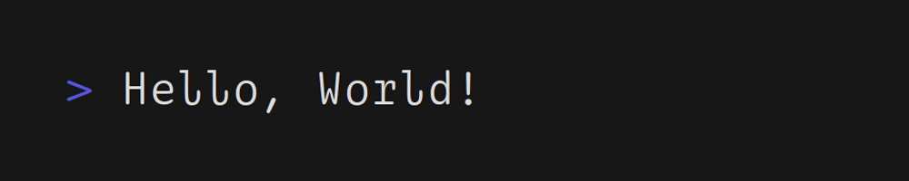

  
  
### 
I'm Andrii, a developer 👨‍💻 studying programming since 2016 🕶️
  
  
- 📚 I’m currently studying in school  
  
- 🐧 Fun fact: I use Linux BTW...  

-  I love Undertale. Papirus <3

-   **one love!**

## 
What I Use

  
  
  
  
  
  
  
  
  

## 
Skills

  
  
  
  
  
  
  
 

## 
Connect with me

  

  
  
   

## 
Github Stats
  

  

   

  

   

            

 
